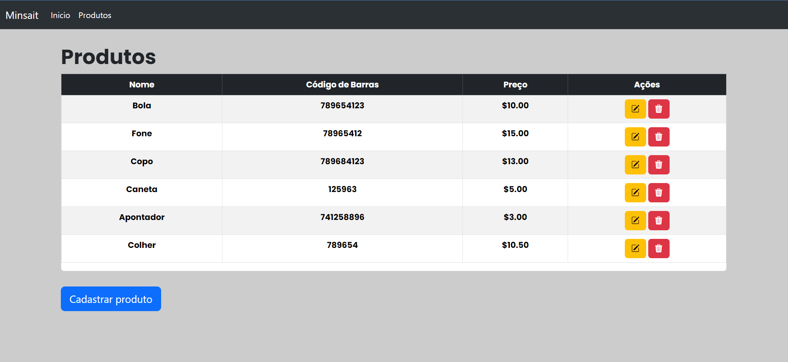

# Aplicação Angular de Gerenciamento de Produtos

Esta é uma aplicação Angular que permite listar, cadastrar, editar e excluir produtos, com conexão a um banco de dados MySQL. A aplicação se integra com uma API Spring para buscar, atualizar e manipular dados de produtos no banco.

## Tecnologias Utilizadas

- Angular
- TypeScript
- HTML/CSS
- API Spring (backend)
- Banco de Dados MySQL

## Funcionalidades

### Listagem de Produtos

- Exibe uma tabela de produtos com as colunas Nome, Código de Barras, Preço e Ações.
- A coluna Ações contém botões para Editar e Excluir produtos.
- Ao clicar em "Editar", o usuário é direcionado para a página de Edição do produto.
- Ao clicar em "Excluir", o produto é removido após confirmação.

### Cadastro de Produtos

- Permite o cadastro de novos produtos com os campos Nome do Produto, Código de Barras e Preço.
- Realiza validações nos campos, incluindo tamanho, obrigatório e tipo número (para o campo Preço).

### Edição de Produtos

- Permite a edição de produtos existentes com os campos Nome do Produto, Código de Barras e Preço.
- Realiza validações nos campos, incluindo tamanho, obrigatório e tipo número (para o campo Preço).

### Exclusão de Produtos

- Permite a exclusão de produtos existentes após confirmação.

## Estrutura do Projeto

O projeto Angular segue uma estrutura de diretórios padrão com componentes para Listagem, Cadastro, Edição e Exclusão de produtos, além de serviços para se comunicar com a API Spring e o banco de dados MySQL.
